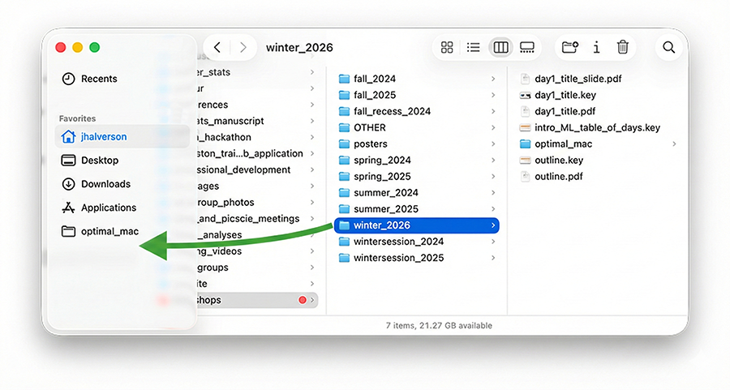
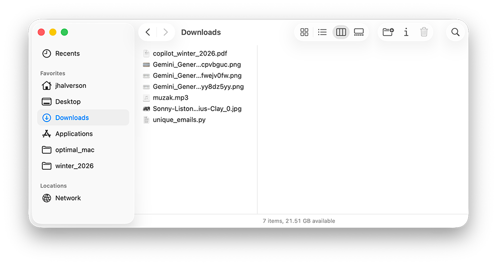

# Basics

## Add Frequently Used Folders to Sidebar

Click on a folder icon and drag it JUST BENEATH the bottom item in the sidebar:

The `winter_2026` folder is now easly accessible:

**Exercise**: Add one of your frequently used folders to the sidebar.

Later we will see how Raycast Quicklinks can also be used to quickly open a Finder window for a specific folder.

## Repeat Rates

Apple > System Settings > Keyboard

Use the fastest "Key repeat rate" that you are comfortable with. Use a small "Delay until repeat". This only applies to **certain applications** like the terminal and VS Code (when using the delete key).

## Tap to Click

Apple > System Settings > Trackpad

Instead of pressing down on the trackpad to click, consider tapping lightly:

## Default Location of Finder

You can specify which folder Finder is showing when it is launched:

Finder > Settings > General > "New finder window to show"

Good choices are your home directory, Recents, or Desktop.

## Remove Items from the Sidebar

Finder > Settings > General > Sidebar

Uncheck any items that you do not use (e.g., Documents, Movies, Music). This will make it easier to spot the useful items.

## Clean the Finder Toolbar

View > "Customize Toolbar..."

Drag items off the toolbar that you have not used. Drag items to the toolbar that you should use. When in doubt, leave items off the toolbar to make it easier to spot the useful items.

## List vs. Column View

Column view is good for navigation. List view is good for sorting files by name or date.

- List view: <kbd>Command</kbd> + <kbd>2</kbd>  
- Column view: <kbd>Command</kbd> + <kbd>3</kbd>  

You can retain the view of a given folder as follows:
1. Select the folder
2. Set the view (e.g., list or column)
3. View > "Show View Options"
4. Make sure "Always Open in <list/column> view" is checked
5. Make additional changes to the settings for that folder

The above applies to a single directory as indicated by the name of the folder at the top of the window. This allows one to assign a specific view to each of the various top-level directories.

## Mission Control vs. Stage Manager

<kbd>Command</kbd> + <kbd>Tab</kbd>: switch between open applications

## Multiple Desktops

Good for cycling between multiple window layouts of different apps.
