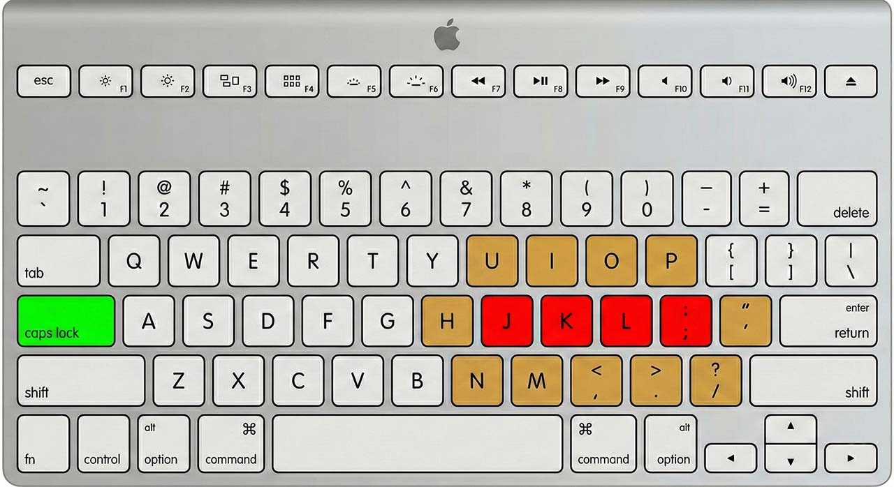
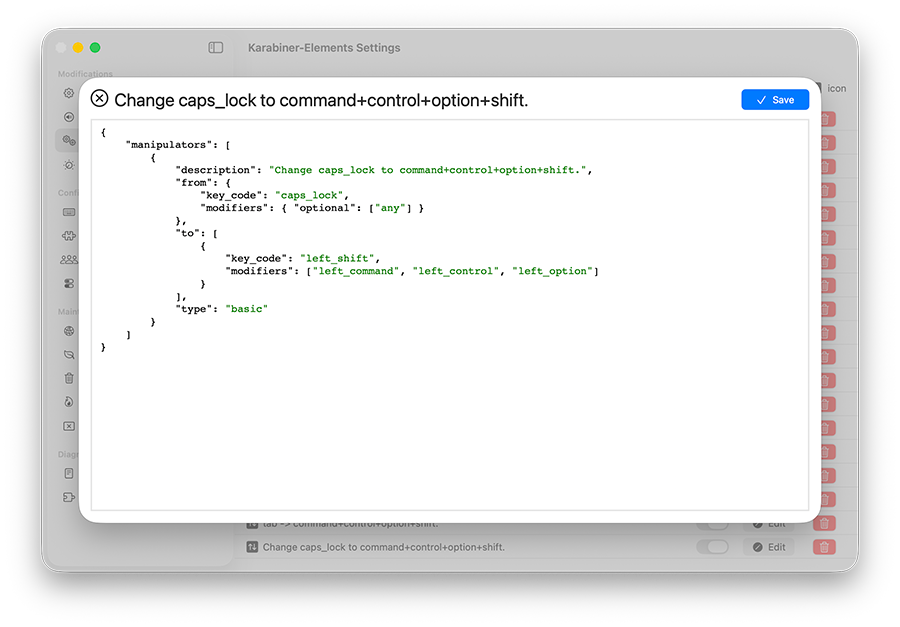
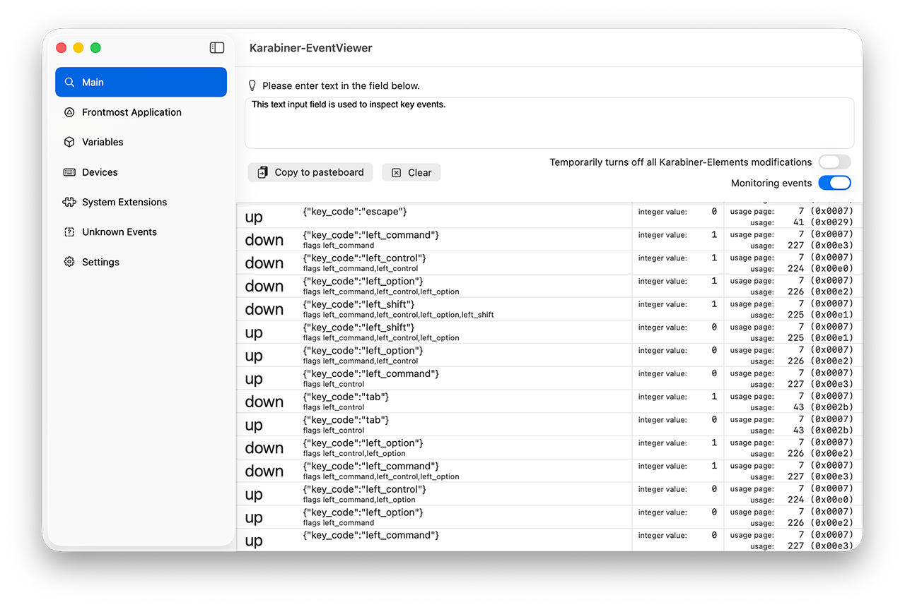

# Keyboard Remappings

In this section, we will install and configure free software to remap keys, create complex shortcuts, and change keyboard behavior.

## Step 1: Install

Install [Karabiner-Elements](https://karabiner-elements.pqrs.org) on your machine.

The software needs input monitoring permissions to capture and modify keystrokes. You will need to make multiple changes to your systems settings. Follow the directions while installing the software.


See all of the [required changes](https://karabiner-elements.pqrs.org/docs/manual/misc/required-macos-settings/) to the System Settings.

## About the Hyper Key

The "hyper key" is the key that you hold down which changes the meaning of all other keys.

The <kbd>Caps Lock</kbd> key is large and accessible but useless to most users. We will configure our keyboard so that when <kbd>Caps Lock</kbd> is held, other keys have a different meaning. For instance, <kbd>Caps Lock</kbd> + <kbd>L</kbd> could launch your Linux terminal or make it the frontmost window.

In this strategy, the most valuable keys are the right home keys (<kbd>J</kbd>, <kbd>K</kbd>, <kbd>L</kbd>, <kbd>Semicolon</kbd>) shown in red in the image below. The <kbd>Space</kbd> key is also valuable since your thumb rests on it. The next most valuable are those shown in orange.



#### Define Your Hyper Key

1. Open the Karabiner-Elements settings
1. In left sidebar, choose "Complex Modifications"
1. Click on "Add your own rule"
1. Copy and paste the contents below and choose "Save"



```json
{
    "manipulators": [
        {
            "description": "Change caps_lock to command+control+option+shift.",
            "from": {
                "key_code": "caps_lock",
                "modifiers": { "optional": ["any"] }
            },
            "to": [
                {
                    "key_code": "left_shift",
                    "modifiers": ["left_command", "left_control", "left_option"]
                }
            ],
            "type": "basic"
        }
    ]
}
```

If you want to test the hyper key:

1. Apple Menu > System Settings > Accessibility > Accessibility Keboard
1. After the graphical keyboard loads, press <kbd>Caps Lock</kbd> and you should see that four keys are actually being triggered.

Next, make a rule to "Select Next Tab" for any application with <kbd>Caps Lock</kbd> + <kbd>N</kbd>:

1. In left sidebar, choose "Complex Modifications"
1. Click on "Add your own rule"
1. Copy and paste the contents below and choose "Save"

```json
{
    "description": "Hyper + N -> next tab",
    "manipulators": [
        {
            "from": {
                "key_code": "n",
                "modifiers": { "mandatory": ["command", "shift", "option", "control"] }
            },
            "to_if_alone": [
                {
                    "key_code": "tab",
                    "modifiers": ["control"]
                }
            ],
            "type": "basic"
        }
    ]
}
```
Try out the new rule. Open a web browser with multiple tabs and try changing tabs with <kbd>Caps Lock</kbd> + <kbd>N</kbd>. This will also work in the Finder.

## More Examples

The following rule launches the Terminal by pressing <kbd>Caps Lock</kbd> + <kbd>L</kbd>:

```json
{
    "description": "Hyper + L -> Linux command line",
    "manipulators": [
        {
            "from": {
                "key_code": "l",
                "modifiers": { "mandatory": ["command", "shift", "option", "control"] }
            },
            "to_if_alone": [{ "software_function": { "open_application": { "file_path": "/Applications/Utilities/Terminal.app" } } }],
            "type": "basic"
        }
    ]
}
```

Scroll down one line with <kbd>Caps Lock</kbd> + <kbd>J</kbd>:

```json
{
    "description": "Hyper + J -> down_arrow",
    "manipulators": [
        {
            "from": {
                "key_code": "j",
                "modifiers": { "mandatory": ["command", "shift", "option", "control"] }
            },
            "to_if_alone": [{ "key_code": "down_arrow" }],
            "type": "basic"
        }
    ]
}
```

In the rule above, for faster scrolling one could use the substitution `"to_if_alone": [{ "key_code": "page_down" }],`.

Mission control is <kbd>Caps Lock</kbd> + <kbd>M</kbd>:

```json
{
    "description": "Hyper + m -> mission control",
    "manipulators": [
        {
            "from": {
                "key_code": "m",
                "modifiers": { "mandatory": ["command", "shift", "option", "control"] }
            },
            "to_if_alone": [{ "apple_vendor_keyboard_key_code": "mission_control" }],
            "type": "basic"
        }
    ]
}
```

When watching a YouTube video, go to the next chapter with <kbd>F9</kbd>:

```json
{
    "description": "f9 to next YouTube chapter",
    "manipulators": [
        {
            "from": { "key_code": "f9" },
            "to": [
                {
                    "key_code": "right_arrow",
                    "modifiers": ["option"]
                },
            ],
            "type": "basic"
        }
    ]
}
```

Make VS Code the frontmost application (or launch it) with <kbd>Caps Lock</kbd> + <kbd>O</kbd> (or maybe use <kbd>C</kbd> instead of <kbd>O</kbd>):

```json
{
    "description": "Hyper + o -> VS Code",
    "manipulators": [
        {
            "from": {
                "key_code": "o",
                "modifiers": { "mandatory": ["command", "shift", "option", "control"] }
            },
            "to_if_alone": [{ "software_function": { "open_application": { "file_path": "/Applications/Visual Studio Code.app" } } }],
            "type": "basic"
        }
    ]
}
```

Make Chrome the frontmost app (or launch it) with <kbd>Caps Lock</kbd> + <kbd>K</kbd>:

```json
{
    "description": "Hyper + K -> [K]hrome",
    "manipulators": [
        {
            "from": {
                "key_code": "k",
                "modifiers": { "mandatory": ["command", "shift", "option", "control"] }
            },
            "to_if_alone": [{ "software_function": { "open_application": { "file_path": "/Applications/Google Chrome.app" } } }],
            "type": "basic"
        }
    ]
}
```

Make Safari the frontmost app (or launch it) with <kbd>Caps Lock</kbd> + <kbd>I</kbd>:

```json
{
    "description": "Hyper + I -> Safari",
    "manipulators": [
        {
            "from": {
                "key_code": "i",
                "modifiers": { "mandatory": ["command", "shift", "option", "control"] }
            },
            "to_if_alone": [{ "software_function": { "open_application": { "file_path": "/Applications/Safari.app" } } }],
            "type": "basic"
        }
    ]
}
```

## Tap vs. Hold: Giving a Key Two Meanings

A key can have a different meaning depending on whether it is quickly pressed and released versus (tap) being pressed for a specified amount of time before being released (held).

Here is an example where pressing <kbd>Caps Lock</kbd> quickly is equivalent to <kbd>Escape</kbd> but the hyper key (as above) if held:

```json
{
    "manipulators": [
        {
            "description": "Change caps_lock to command+control+option+shift.",
            "from": {
                "key_code": "caps_lock",
                "modifiers": { "optional": ["any"] }
            },
            "parameters": {
                "basic.to_if_alone_timeout_milliseconds": 150,
                "basic.to_if_held_down_threshold_milliseconds": 150
            },
            "to_if_alone": [{ "key_code": "escape" }],
            "to_if_held_down": [
                {
                    "key_code": "left_shift",
                    "modifiers": ["left_command", "left_control", "left_option"]
                }
            ],
            "type": "basic"
        }
    ]
}
```

The `to_if_alone_timeout_milliseconds` parameter determines how long the application waits for another key event after a specified key is pressed before concluding it was a "single press".

The `to_if_held_down_threshold_milliseconds` parameter defines the delay before special actions trigger for a key held down, distinguishing it from a quick tap; a lower value means less waiting (faster response but more misfires), while a higher value requires a longer press, reducing accidental activation.

Here is another example:

```json
{
    "description": "Semicolon to right arrow plus enter when held",
    "manipulators": [
        {
            "from": { "key_code": "semicolon" },
            "parameters": {
                "basic.to_if_alone_timeout_milliseconds": 250,
                "basic.to_if_held_down_threshold_milliseconds": 250
            },
            "to_if_alone": [{ "key_code": "right_arrow" }],
            "to_if_held_down": [
                { "key_code": "right_arrow" },
                { "key_code": "return_or_enter" }
            ],
            "type": "basic"
        }
    ]
}
```

If the semicolon key is pressed and released in under 250 milliseconds then that is equivalent to pressing the right arrow key. If held for more than 250 ms then it is equivalent to pressing right arrow followed by return. Note that the hyper key is not used.

Later in this repository we will demostrate `Warp` in the `terminal_emulators` directory where the rule above will be useful.

## Using the Karabiner EventViewer

Karabiner EventViewer is an application that you installed in Step 1 above. It shows you the key codes for the keys you press. It is useful for creating rules because it shows you the names of the keys that you are pressing.



## What are the Best Mappings for You?

Everyone is different. Think of the best shortcuts for your workflow.

A general rule is not to use keyboards shortcuts for web browsers since those tend to use the mouse/trackpad. Try to think of cases that will allow you to STAY ON THE KEYBOARD as opposed to going to the mouse/trackpad.

See examples of [various rules](https://ke-complex-modifications.pqrs.org/) used by the Karabiner-Elements community.

## Additional Hyper Keys (Advanced)

It's nice to have the letter of the second key have some meaning (like <kbd>N</kbd> for next tab or <kbd>L</kbd> for Linux termina). Holding <kbd>Caps Lock</kbd> ties up your left hand leaving only a few letters for the second key (to be pressed with your right hand).

You can configure Karabiner-Elements to use <kbd>Caps Lock</kbd> plus a second key as the hyper key to create more freedom. For instance, for operations concerning moving and resizing windows, one might use <kbd>Caps Lock</kbd> + <kbd>W</kbd> + (any third key). A specific example might be <kbd>Caps Lock</kbd> + <kbd>W</kbd> + <kbd>M</kbd> maximizes the current window.

## Profiles

Profiles allow you to have different sets of rules for different modes of work. For example, you could have one set for doing research, a second set for a particular project, and third set for a specific app (e.g., Final Cut Pro X for video editing). It is also a good idea to create a profile called "Off" (without any rules) in case you need to turn everything off.


You can switch profiles on-the-fly using the menu bar:


## Config File

Your configuration file is stored here:

```
/Users/<username>/.config/karabiner/karabiner.json
```

Configuration files can be shared and should be backed up.

## Home Row Mods

Instead of using a hyper key, one could map the modifier keys to the home row keys. When the key is held the modifer becomes active. When it is quickly tapped the key operates as usual. We will not explore this in the workshop.


