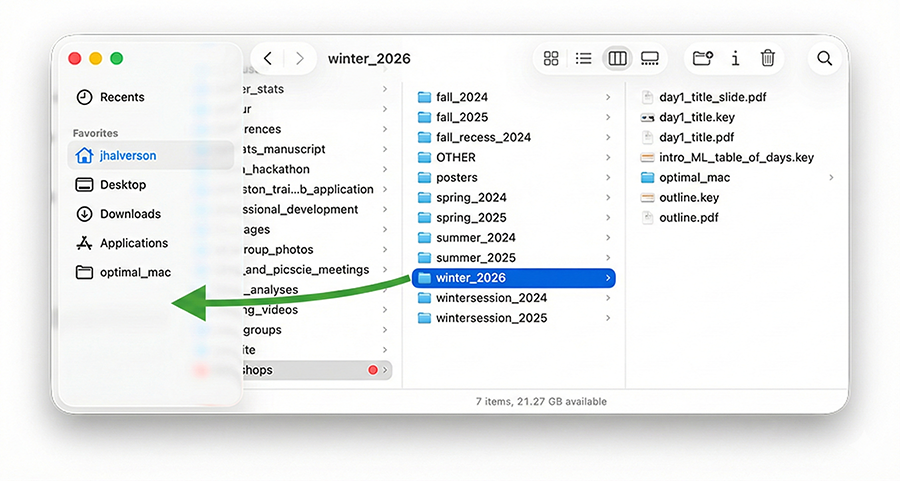
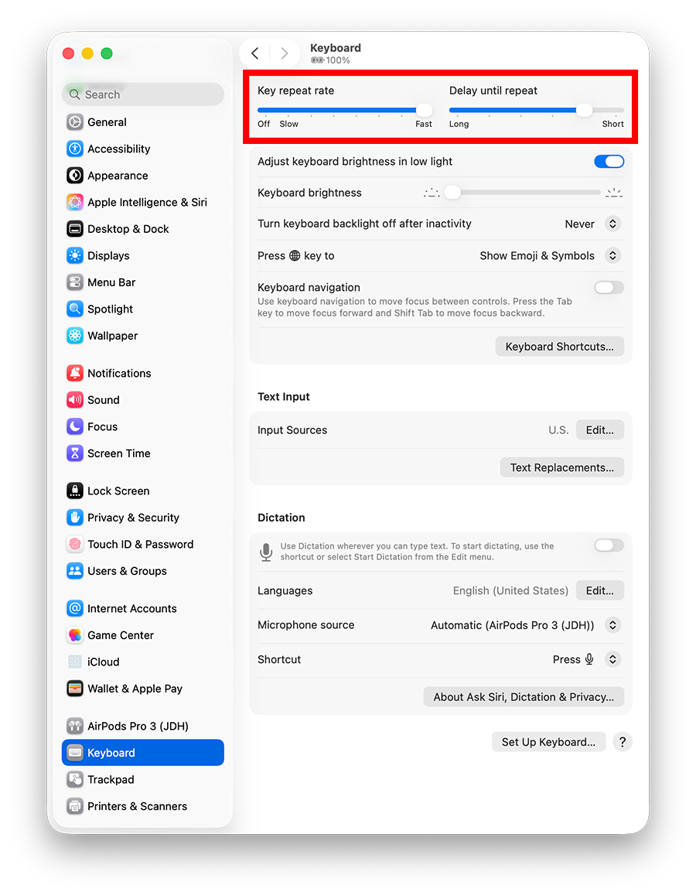

# Basics

## Add Frequently Used Folders to Sidebar

Click on a folder icon and drag it to the sidebar:

**Exercise**: Add one of your frequently used folders to the sidebar.

## Repeat Rates

Apple > System Settings > Keyboard

Use the fastest "Key repeat rate" that you are comfortable with. Use a small "Delay until repeat".

## Tap to Click

Apple > System Settings > Trackpad

Instead of pressing down on the trackpad to click, consider tapping lightly:

