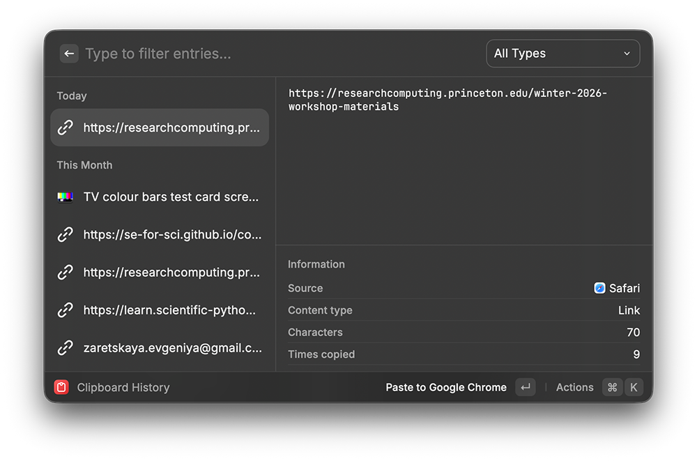
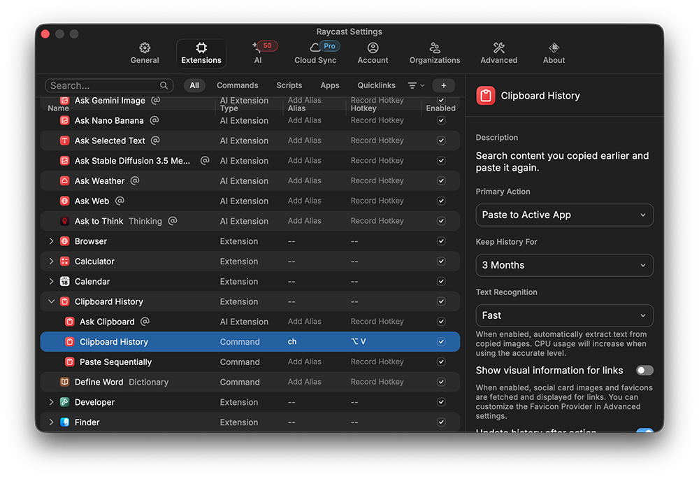

# Clipboard Manager

Until recently Mac allowed for one item in the clipboard (<kbd>Control</kbd> + <kbd>C</kbd>). The latest version of Spotlight improved on this but it is still limited. Here we will use Raycast as our clipboard manager.

## Raycast

Configure Raycast to <kbd>Option</kbd> + <kbd>V</kbd> to launch the clipboard manager.

1. Open Raycast Settings: Launch Raycast (e.g., with <kbd>Command</kbd> + <kbd>Space</kbd>) and type Settings, or press <kbd>Command</kbd> + <kbd>Comma</kbd>.
1. Go to Extensions: In the Settings window, navigate to the Extensions tab.
1. Enable Clipboard History: Find the "Clipboard History" extension in the list and ensure it's enabled (toggled on).
1. Assign a Hotkey:
    * Click on the Clipboard History extension in the list.
    * Find the "Hotkey" column and set a custom shortcut, such as <kbd>Option</kbd> + <kbd>V</kbd>, for instant access.

Now launch it with <kbd>Option</kbd> + <kbd>V</kbd>:

Things you can do:
- double click on an entry in the left sidebar to paste the item
- search the clipboard history (start typing where it says "Type to filter entries...")
- pin entries to make them appear at the top (for up to 1 year)
- check out the metadata on the right by clicking on an item in the left
- adjust the lifetime of items in the history (up to 3 months is limit for unpinned entries)

## Paste App

If you need a more powerful clipboard manager than what Raycast provides then see [Paste](https://pasteapp.io) ($29.99/year). Also, look at [Setapp](https://setapp.com) which is a subscription to a few hundred potentially useful Mac apps (see also BusyCal, Substage, CleanShot X, BetterTouchTool and more).
