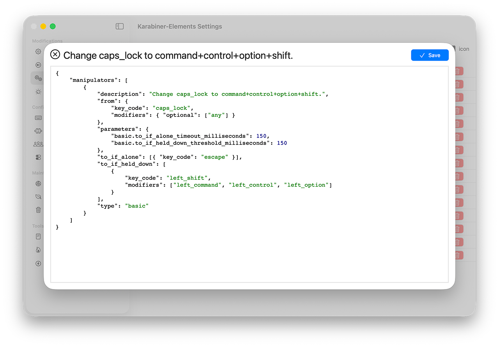

# Keyboard Remappings

In this section, we will install and configure free software to remap keys, create complex shortcuts, and change keyboard behavior.

## Step 1: Install

Install [Karabiner-Elements](https://karabiner-elements.pqrs.org) on your machine.

The software needs input monitoring permissions to capture and modify keystrokes. You will need to make multiple changes to your systems settings. Follow the directions while installing the software.

## Step 2: About the Meta Key

The "meta key" is the key that you hold down which changes the meaning of all other keys.

The [caps lock] key is large and accessible but useless to most users. We will configure our keyboard so that when the caps lock key is held, other keys have a different meaning. For instance, [caps lock] + [L] could launch your Linux terminal or make it the top window.

The most valuable key are the right home keys ([J], [K], [L], [;]) shown in red in the image below. The next most valuable are those shown in orange.


#### Define Your Meta Key

1. Open the Karabiner-Elements settings
1. In left sidebar, choose "Complex Modifications"
1. Click on "Add your own rule"
1. Copy and paste the contents below and choose "Save"




```json
{
    "manipulators": [
        {
            "description": "Change caps_lock to command+control+option+shift.",
            "from": {
                "key_code": "caps_lock",
                "modifiers": { "optional": ["any"] }
            },
            "parameters": {
                "basic.to_if_alone_timeout_milliseconds": 150,
                "basic.to_if_held_down_threshold_milliseconds": 150
            },
            "to_if_alone": [{ "key_code": "escape" }],
            "to_if_held_down": [
                {
                    "key_code": "left_shift",
                    "modifiers": ["left_command", "left_control", "left_option"]
                }
            ],
            "type": "basic"
        }
    ]
}
```

The `to_if_alone_timeout_milliseconds` parameter determines how long the application waits for another key event after a specified key is pressed before concluding it was a "single press".

The `to_if_held_down_threshold_milliseconds` parameter defines the delay before special actions trigger for a key held down, distinguishing it from a quick tap; a lower value means less waiting (faster response but more misfires), while a higher value requires a longer press, reducing accidental activation.

Next, make a rule to "Select Next Tab" for any application with [caps lock] + [N]:

1. In left sidebar, choose "Complex Modifications"
1. Click on "Add your own rule"
1. Copy and paste the contents below and choose "Save"

```json
{
    "description": "Hyper + N -> next tab",
    "manipulators": [
        {
            "from": {
                "key_code": "n",
                "modifiers": { "mandatory": ["command", "shift", "option", "control"] }
            },
            "to_if_alone": [
                {
                    "key_code": "tab",
                    "modifiers": ["control"]
                }
            ],
            "type": "basic"
        }
    ]
}
```

The following rule launches the Terminal by pressing [caps lock] + [L]: 

```json
{
    "description": "Hyper + L -> Linux command line",
    "manipulators": [
        {
            "from": {
                "key_code": "l",
                "modifiers": { "mandatory": ["command", "shift", "option", "control"] }
            },
            "to_if_alone": [{ "software_function": { "open_application": { "file_path": "/Applications/Terminal.app" } } }],
            "type": "basic"
        }
    ]
}
```

Scroll down with [caps lock] + [J]:

```json
{
    "description": "Hyper + J -> down_arrow",
    "manipulators": [
        {
            "from": {
                "key_code": "j",
                "modifiers": { "mandatory": ["command", "shift", "option", "control"] }
            },
            "to_if_alone": [{ "key_code": "down_arrow" }],
            "type": "basic"
        }
    ]
}
```

Mission control is [caps lock] + [M]:

```json
{
    "description": "Hyper + m -> mission control",
    "manipulators": [
        {
            "from": {
                "key_code": "m",
                "modifiers": { "mandatory": ["command", "shift", "option", "control"] }
            },
            "to_if_alone": [{ "apple_vendor_keyboard_key_code": "mission_control" }],
            "type": "basic"
        }
    ]
}
```

## More Examples

Launch Chrome with [caps lock] + [K]:

```json
{
    "description": "Hyper + K -> Khrome",
    "manipulators": [
        {
            "from": {
                "key_code": "k",
                "modifiers": { "mandatory": ["command", "shift", "option", "control"] }
            },
            "to_if_alone": [{ "software_function": { "open_application": { "file_path": "/Applications/Google Chrome.app" } } }],
            "type": "basic"
        }
    ]
}
```

Make Safair the frontmost app (or launch) with [caps lock] + [I]:

```json
{
    "description": "Hyper + I -> Safari",
    "manipulators": [
        {
            "from": {
                "key_code": "i",
                "modifiers": { "mandatory": ["command", "shift", "option", "control"] }
            },
            "to_if_alone": [{ "software_function": { "open_application": { "file_path": "/Applications/Safari.app" } } }],
            "type": "basic"
        }
    ]
}
```

## Tap vs. Hold: Giving a Key Two Meanings

A key can have a different meaning depending on whether it is quickly pressed and released versus being pressed for a specified amount of time before being released.

Here is an example:

```json
{
    "description": "Semicolon to right arrow plus enter when held",
    "manipulators": [
        {
            "from": { "key_code": "semicolon" },
            "parameters": {
                "basic.to_if_alone_timeout_milliseconds": 250,
                "basic.to_if_held_down_threshold_milliseconds": 250
            },
            "to_if_alone": [{ "key_code": "right_arrow" }],
            "to_if_held_down": [
                { "key_code": "right_arrow" },
                { "key_code": "return_or_enter" }
            ],
            "type": "basic"
        }
    ]
}
```

If the semicolon key is pressed and released in under 250 milliseconds then that is equivalent to pressing the right arrow key. If held for more than 250 ms then it is equivalent to pressing right arrow followed by return. Notice the hyper key is not used. How to make a semicolon if needed?

Later in this repository we will demostrate the [Warp terminal emulator](https://www.warp.dev) where the rule above will be useful.

## Using the Karabiner EventViewer

Karabiner EventViewer is an app that you installed in Step 1. It shows you the key codes for the keys you press. It is useful for creating rules because it shows you the names of the keys that you are pressing.


## What are the best mappings for you?

Everyone is different. Think of the best shortcuts for your workflow.

A general rule is not to use keyboards shortcuts for web browsers since those tend to use the mouse/trackpad. Try to think of cases that will allow you to STAY ON THE KEYBOARD as opposed to going to the mouse/trackpad.

## Additional Meta Keys (Advanced)

It's nice to have the letter of the second key have some meaning (like [N] for next tab, or [L] for Linux termina). Holding the [caps lock] meta key ties up your left hand leaving only a few letters for the second key (to be pressed with your right hand).

You can configure Karabiner-Elements to use [caps lock] plus a second key as the hyper to create more freedom. For instance, for operations concerning moving and resizing windows, one might use [caps lock] + [W] + (any third key). A specific example would be [caps lock] + [W] + [J] maximizes the current window.

One could also use left tab or left shift as a different meta key.

## Profiles

One can create different sets of rules for a given profile. Profiles allow you to have different sets of rules. For example, you could have one set for doing research, a second set for video editing, and third set for a specific app.
