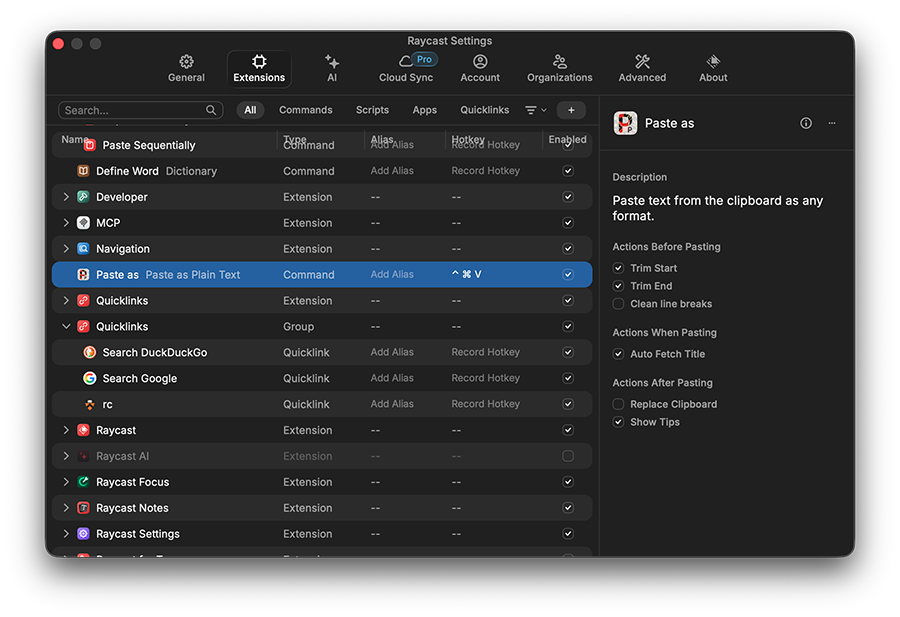

# Raycast

[Raycast](https://www.raycast.com) is a collection of productivity tools within an extendable launcher. See the [Raycast Mac Manual](https://manual.raycast.com/mac).

## Install

Install [Raycast](https://www.raycast.com)  on your Mac.

Next, [set the global hotkey](https://manual.raycast.com/hotkey) to <kbd>Command</kbd> + <kbd>Space</kbd>. To do this, open Raycast and then do <kbd>Command</kbd> + <kbd>Comma</kbd>. Click on "General" then set the Raycast Hotkey.

## Lanching Raycast

Launch Raycast with <kbd>Command</kbd> + <kbd>Space</kbd>


To close Raycast, hit <kbd>ESC</kbd> or click on another window or <kbd>Command</kbd> + <kbd>Space</kbd>

## Opening the Raycast Settings

Launch Raycast then <kbd>Command</kbd> + <kbd>Comma</kbd>


## Clipboard Manager

One of the most useful features in the [clipboard manager](../clipboard_manager/README.md).

## Search Files

Raycast uses the Spotlight index (built-in) to search for files by filename and content.

Open Raycast and run the "Search Files" command. Learn more about [Search Files](https://manual.raycast.com/core#Search%20Files).

It is common to assign an alias of "sf" to the "Search Files" command.

Our recommendation: Assign a Hotkey to "Search Files" such as <kbd>Caps Lock</kbd> + <kbd>F</kbd> or <kbd>Caps Lock</kbd> + <kbd>S</kbd>

Also, be sure to turn on searching within files: Raycast Settings > Extensions > Search Files (see "Search by Files and Contents" below):


## Snippets

A [snippet](https://manual.raycast.com/snippets) is a block of text that can be recalled. Snippets are handy for frequently used text such as canned email responses, code or emojis.

To create a snippet:

1. Launch Raycast
1. Search "Create snippet"
1. Create a snippet by giving it a name and entering the snippet

Use keywords to be replaced by a specified snippet.

Use dynamic placeholders {}  <kbd>Control</kbd> + <kbd>Option</kbd> + <kbd>Shift</kbd> + <kbd>Q</kbd> is **⌃⌥⇧⌘Q**

Learn about using [dynamic placeholders](https://manual.raycast.com/dynamic-placeholders) in snippets.

Using the snippet below, after copying the person's first name to the clipboard, `{clipboard}` will be replaced:

```
Hi {clipboard},

Yes, I will attend. See you there.

Jon
```

Here is a code example that using `{cursor}` and `{date}` -- it computes the number of CPU-hours used in the last week for user `jdh4`:

```
sacct -M della -u jdh4{cursor} -X -n -S {date format="yyyy-MM-dd" offset="-7d"}T00:00:00 -E now -o cputimeraw | awk '{sum += $1} END {print int(sum/3600)}'
```

**Exercise**: Create two or three snippets.

Note that rather than typing the keyword, one could use Karabiner-Elements to assign it to a key. For instance, if the keyword of the snippet is `@attend`:

```json
{
    "description": "f6 to @attend",
    "manipulators": [
        {
            "from": { "key_code": "f6" },
            "to": [
                {
                    "key_code": "2",
                    "modifiers": ["shift"]
                },
                { "key_code": "a" },
                { "key_code": "t" },
                { "key_code": "t" },
                { "key_code": "e" },
                { "key_code": "n" },
                { "key_code": "d" }
            ],
            "type": "basic"
        }
    ]
}
```

## Quicklinks

Learn about and create a few [Quicklinks](https://manual.raycast.com/quicklinks).

**Exercise 1**: Add the "Search Wikipedia" Quicklink. Then select a word in an app and run the Wikipedia Quicklink.

**Exercise 2**: Create a new quicklink that opens your favorite browser to `https://www.princeton.edu` or another URL. Consider making a `Hotkey` so that you can get there using only the keyboard (maybe <kbd>Caps Lock</kbd> + <kbd>P</kbd>).

## Calculator

Learn about the [calculator](https://manual.raycast.com/calculator).

The calculator history is stored (see the command "Calculator History").

## Window Management

Learn about [resizing, moving and arranging windows](https://manual.raycast.com/window-management).

You will be prompted to set Accessibility permissions in your Security and Privacy settings. Only needed once.

**Exercise**: Set some Hotkeys for useful operations. To have the frontmost window fill the "Right Half" of the screen consider <kbd>Control</kbd> + <kbd>Option</kbd> + <kbd>Right Arrow</kbd>

## Raycast Store

Get free, open-source extensions at the [Raycast Store](https://manual.raycast.com/store).

Install the extension [Paste as Plain Text](https://www.raycast.com/koinzhang/paste-as-plain-text) and use a Hotkey such as <kbd>Control</kbd> + <kbd>Command</kbd> + <kbd>V</kbd> to remove HTML and other formatting.

To install:

1. Search on "store" in Raycast
1. In the store, search on "paste as"
1. Double click on "Paste as Plain Text"
1. Press <kbd>Return</kbd> to install the extension



To set the Hotkey:

1. Open the Raycast Settings
1. Click on "Extensions"
1. Search for "paste as"
1. Click on "Paste as Plain Text"
1. Click on "Record Hotkey" then <kbd>Control</kbd> + <kbd>Command</kbd> + <kbd>V</kbd>

## Learn More Raycast

- [Raycast Mac Manual](https://manual.raycast.com/mac)
- [Raycast on YouTube](https://www.youtube.com/@raycastapp/videos)
