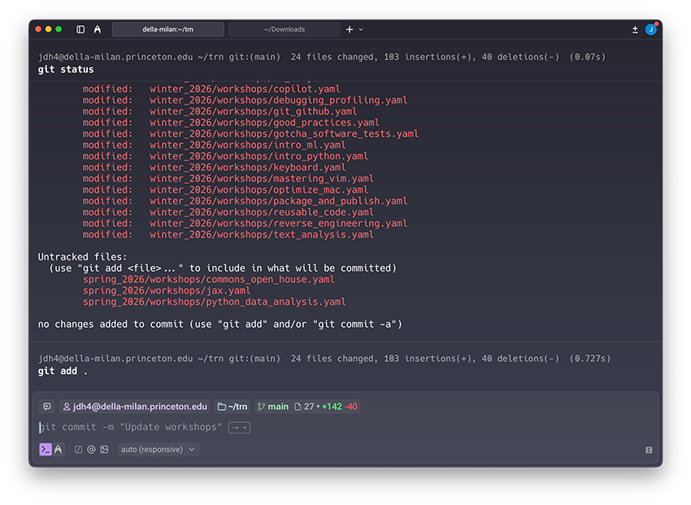

# Terminals

## Warp

The [Warp terminal](https://www.warp.dev) is designed for AI code development but it can be used a replacement for Terminal. Warp is free (they only ask for an email address).



The big advantage of Warp is that it tries to predict your next command using an LLM. In the image above, the previous command was `git add .` and it is suggesting the next command to be `git commit -m "Update workshops"`.

If you use Warp and you do not need the semicolon often then use the following rule:

```json
{
    "description": "Semicolon to right arrow (plus enter when held)",
    "manipulators": [
        {
            "from": { "key_code": "semicolon" },
            "parameters": {
                "basic.to_if_alone_timeout_milliseconds": 250,
                "basic.to_if_held_down_threshold_milliseconds": 250
            },
            "to_if_alone": [{ "key_code": "right_arrow" }],
            "to_if_held_down": [
                { "key_code": "right_arrow" },
                { "key_code": "return_or_enter" }
            ],
            "type": "basic"
        }
    ]
}
```

To accept the predicted command press and hold the semicolon key. To modify the predicted command, tap the semicolon key then make edits before entering.

If you actually need a semicolon then use something like <kbd>Caps Lock</kbd> + <kbd>'</kbd>.

## VS Code

Enable "Terminal Suggest" to turn on terminal intellisense or autocomplete.

## iTerm2

The built-in Terminal application of macOS is insufficient. At least use [iTerm2](https://iterm2.com) as a replacement.

## Others

Ghostty does not work with the Research Computing clusters. Take a look at [Alacritty](https://alacritty.org).
